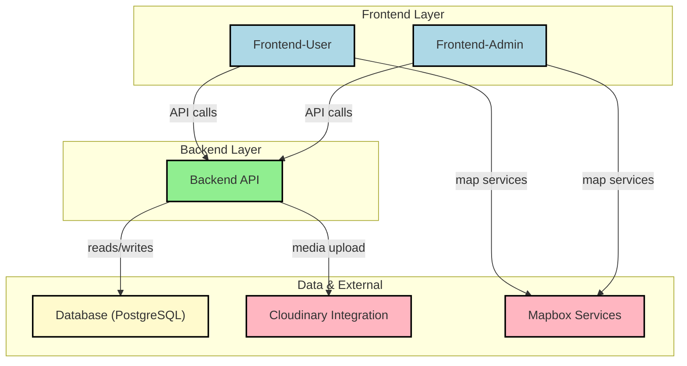

<p align="center">
  <a href="https://www.uit.edu.vn/" title="University of Information Technology" style="border: none;">
    
  </a>
</p>

<h1 align="center"><b>IE402.Q11 - Geographic Information Systems 3D</b></h1>

## Project Group:
| **No.** | **Student ID** | **Full Name**          | **Role**     |
| ------- | -------------- | ---------------------- | ------------ |
| 1       | 22521172       | Võ Nhất Phương         | Group Leader |
| 2       | 22520298       | Lê Nguyễn Thùy Dương   | Member       |
| 3       | 22521641       | Nguyễn Đăng Hương Uyên | Member       |
| 4       | 22520861       | Hoàng Gia Minh         | Member       |
| 5       | 22521082       | Bùi Thanh Phong        | Member       |
| 6       | 22521121       | Lê Thiên Phúc          | Member       |
| 7       | 22520983       | Phạm Trung Nguyên      | Member       |
| 8       | 22520545       | Lâm Quốc Huy           | Member       |

## Course Introduction:
* **Course Title:** Geographic Information Systems 3D  
* **Course Code:** IE402.Q11  
* **Academic Year:** Semester 1 (2025 - 2026)  
* **Instructor:** MSc. Phan Thanh Vũ

Venture Travel Management System
============

Venture is a comprehensive travel management platform that combines interactive 2D mapping, real-time tour tracking, and comprehensive booking management. The system enables users to explore tours across Vietnam, from coastal islands to mountain ranges, with features including interactive maps, 360-degree exploration, province-based navigation, and detailed tour information. This platform provides both travelers and administrators with powerful tools to discover, book, and manage travel experiences throughout Vietnam.

[](https://opensource.org/licenses/MIT)
* * * * *

Table of Contents
-----------------

- [Venture Travel Management System](#venture-travel-management-system)
  - [Table of Contents](#table-of-contents)
  - [Features](#features)
    - [**User Features**:](#user-features)
    - [**Admin Features**:](#admin-features)
  - [Tech Stack](#tech-stack)
  - [System Architecture](#system-architecture)
  - [Running the Project](#running-the-project)
    - [Prerequisites](#prerequisites)
    - [Optional Tools](#optional-tools)
    - [Steps](#steps)
  - [Setting Up Environment Variables](#setting-up-environment-variables)
  - [Running the Project](#running-the-project-1)
    - [Local Development](#local-development)
      - [Access the Application](#access-the-application)
  - [Deployment](#deployment)
    - [Backend API](#backend-api)
    - [Frontend User](#frontend-user)
    - [Frontend Admin](#frontend-admin)

* * * * *

Features
--------

### **User Features**:
-   Sign up, log in, log out, reset password with email verification
-   Google OAuth authentication
-   Browse and search tours with advanced filtering (price, duration, category, region)
-   View detailed tour information including itineraries, inclusions, exclusions
-   Interactive 2D map showing tours and destinations across Vietnam
-   360-degree virtual exploration of destinations
-   Province-based navigation and exploration
-   View attractions and their details
-   Book tours with multiple ticket types and price categories
-   Manage booking history with status tracking (processing, completed, cancelled)
-   Cancel bookings with confirmation dialog
-   Write and manage reviews for tours and attractions
-   Upload images with reviews
-   View and manage favorite tours
-   View weather information for provinces
-   Contact support and submit inquiries
-   Multi-language support (Vietnamese, English)
-   Responsive design for mobile and desktop

### **Admin Features**:
-   View comprehensive dashboard with statistics and reports
-   Manage tours (create, edit, delete, update status)
-   Manage attractions (create, edit, delete)
-   Manage provinces and regions
-   Manage tour routes and waypoints
-   Manage bookings (view, update status, process)
-   Manage users (view, update, manage accounts)
-   Manage reviews (view, moderate, delete)
-   Manage inquiries and contact messages
-   Generate reports (bookings, revenue, tours)
-   Export data to Excel and PDF
-   Change password
-   Admin account management

* * * * *

Tech Stack
----------

-   **Frontend User**: React.js, TypeScript, Vite, Tailwind CSS, React Router, React Query, Mapbox GL, i18next
-   **Frontend Admin**: React.js, TypeScript, Vite, Tailwind CSS, React Router, React Query, Recharts
-   **Backend**: Node.js, Express.js, TypeScript, Prisma ORM, JWT (Authentication), Google OAuth, Nodemailer
-   **Package Manager**: npm
-   **Database**: PostgreSQL

* * * * *

System Architecture
----------



* * * * *

Running the Project
----------
### Prerequisites

- **Node.js** (v18 or newer)
- **npm** or **yarn**
- **PostgreSQL** (v14 or newer)
- **Git**
- **VSCode** or any code editor

### Optional Tools

- PostgreSQL (cloud)
- Postman (for testing APIs)

### Steps

1.  Clone the repository:

    ```bash
    git clone https://github.com/vonhatphuongahihi/Venture-Travel-Management
    cd Venture-Travel-Management
    ```

2.  Install dependencies:

    -   **Backend**:

        ```bash
        cd backend
        npm install
        ```

    -   **Frontend-user**:
        ```bash
        cd frontend-user
        npm install
        ```

    -   **Frontend-admin**:
        ```bash
        cd frontend-admin
        npm install
        ```

* * * * *

Setting Up Environment Variables
--------------------------------

1.  **Backend**:

    -   Create a `.env` file in the `backend` directory.
    -   Add your environment variables:
        ```env
        # Database
        DATABASE_URL=your-postgresql-database-url
        
        # JWT
        JWT_SECRET=your-jwt-secret
        JWT_EXPIRES_IN=7d

        # Server
        PORT=3001
        NODE_ENV=development

        # CORS
        CORS_ORIGIN=http://localhost:8081,http://localhost:8082

        # SMTP
        SMTP_HOST=smtp.gmail.com
        SMTP_PORT=587
        SMTP_USER=your-email@gmail.com
        SMTP_PASS=your-email-app-password
        SMTP_FROM="Venture <your-email@gmail.com>"

        FRONTEND_URL=http://localhost:8081

        # Cloudinary for image upload
        CLOUDINARY_CLOUD_NAME=your-cloudinary-cloud-name
        CLOUDINARY_API_KEY=your-cloudinary-api-key
        CLOUDINARY_API_SECRET=your-cloudinary-api-secret

        # Google OAuth
        GOOGLE_CLIENT_ID=your-google-client-id
        GOOGLE_CLIENT_SECRET=your-google-client-secret
        GOOGLE_CALLBACK_URL=http://localhost:3001/api/auth/google/callback

        # Mapbox Token
        MAPBOX_ACCESS_TOKEN=your-mapbox-access-token
        ```

2.  **Frontend-user**:
    -   Create a `.env` file in the `frontend-user` directory.
    -   Add your environment variables:
        ```env
        VITE_API_URL=http://localhost:8081
        VITE_MAPBOX_TOKEN=your-mapbox-token
        ```

3.  **Frontend-admin**:
    -   Create a `.env` file in the `frontend-admin` directory.
    -   Add your environment variables:
        ```env
        VITE_API_URL=http://localhost:8081
        ```

Running the Project
-------------------

### Local Development
1.  **Backend Setup:**
    ```bash
    cd backend
    npm install
    npm run dev
    ```

2.  **Frontend User Setup:**
    ```bash
    cd frontend-user
    npm install
    npm run dev
    ```

3.  **Frontend Admin Setup:**
    ```bash
    cd frontend-admin
    npm install
    npm run dev
    ```

#### Access the Application

- Frontend User: http://localhost:8081
- Frontend Admin: http://localhost:8082
- Backend API: http://localhost:3001

* * * * *

Deployment
----------

The application is deployed on the following platforms:

### Backend API
- **Platform**: Render
- **URL**: [Venture Backend](https://venture-travel-management.onrender.com)

### Frontend User
- **Platform**: Vercel
- **URL**: [Venture User](https://venture-travel-management.vercel.app)

### Frontend Admin
- **Platform**: Vercel
- **URL**: [Venture Admin](https://venture-travel-management-admin.vercel.app)
